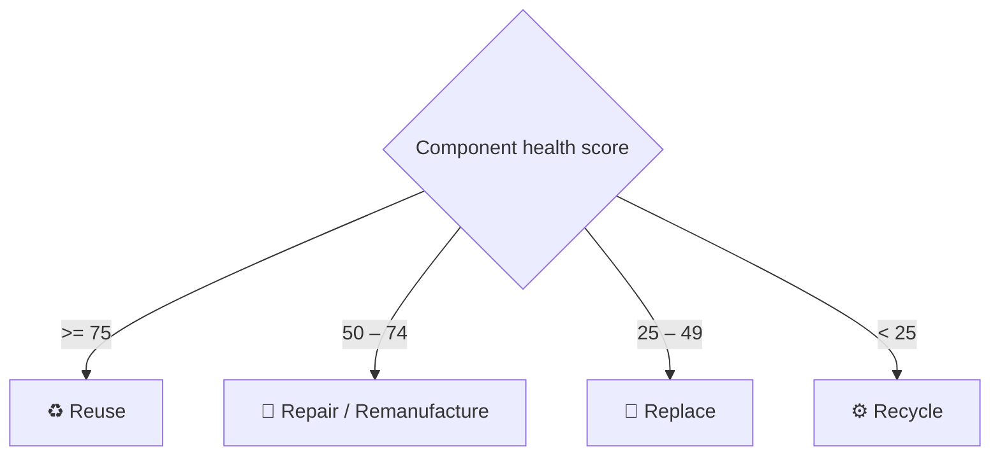

<div align="center">

# ⚙️ UR5e Circular Motor Recovery

*Teaching a UR5e cobot to disassemble failed cooling-system motors and sort every part into*
*&nbsp;**Reuse · Repair · Replace · Recycle** — turning industrial scrap back into recovered value.*

<br>


<br>

`Universal Robots UR5e` &nbsp;•&nbsp; `Robotiq 2F-85 gripper` &nbsp;•&nbsp; `ros2_control` &nbsp;•&nbsp; `Digital Product Passport` &nbsp;•&nbsp; `Circular Economy`

</div>

---

## 🌍 The Problem

Dubai runs on cooling. District cooling plants, chillers, cooling towers, pumps, AHUs, hotels, malls and towers all depend on a vast fleet of electric motors — and when one fails, it is usually scrapped whole. Yet a "dead" motor still holds reusable **housings, covers, rotors, stators, shafts, bearings, fans and terminal boxes**, plus recoverable copper and steel.

**UR5e Circular Motor Recovery** is a simulation-based, **hardware-ready** demonstrator of a robotic recovery cell that inspects each motor, decides the best circular-economy outcome for *every individual component*, and has a cobot sort them — defaulting to low-value scrap only as a last resort.

> This is not just an animation. It is a working architecture designed to become a real industrial digital twin by swapping mock data and simulated execution for physical robot drivers, calibrated perception, live sensors and real plant data — **without changing the interfaces.**

---

## 🤔 So why isn't this already how it's done?

Worth answering directly, because it is the first question any recycler will ask.

**Today, end-of-life motors are mostly shredded.** The scrap stream is crushed and screened,
ferrous material is pulled magnetically, and copper is recovered downstream with eddy-current
separation. It is fast, it needs no perception, and it scales. Selective disassembly competes
against that, not against doing nothing — and the industry rule of thumb is blunt: if
dismantling costs roughly ten minutes of labour, only the larger motors carry enough copper to
justify it.

**So the interesting question is not "can a robot take a motor apart" — it is where the
crossover sits.** Shredding destroys component-level value: a sound housing, rotor, shaft,
bearing or terminal box is worth far more as a part than as shredded metal, but only if you can
identify and extract it without spending more than it is worth. That is why this cell is
modelled **per component** rather than per motor, and why the decision engine emits a route for
every part instead of a single verdict for the whole unit.

**What would move the crossover:** rising component reuse value, a Digital Product Passport that
removes the cost of *identifying* what you're holding, cobot cells cheap enough to sit inside an
existing workshop, and regulation that prices material recovery below reuse. Robotic disassembly
for the circular economy is an active research area for exactly this reason — task-and-motion
planning for end-of-life products is an open problem, and comparable cells in the adjacent
EV-battery domain have been demonstrated at productivity matching several human operators.

**What this repository does not claim:** it does not show that a UR5e cell is cheaper than a
shredder. It builds the architecture and the per-component decision layer you would need to
answer that question with real cost data and real perception.

---

## ✨ Highlights

- 🤖 **Full robotic cell in simulation** — one UR5e + Robotiq 2F-85 gripper, a source table, four category tables and **11 separable, gravity-enabled motor parts** in Gazebo.
- 🧠 **Re-X decision engine** — scores component health & risk from a Digital Product Passport plus a sensor stream, then routes each part to *reuse / repair / replace / recycle*.
- 🦾 **Real motion planning** — MoveIt 2 with `arm` / `gripper` groups, named station poses, and trajectory execution through `ros2_control`.
- 🔁 **End-to-end MVP workflow** — a 17-step pick-and-place recovery sequence that writes live progress for downstream consumers.
- 📊 **Operator dashboard** — a Streamlit app for analytics, decision review and a digital-twin readiness checklist.
- 🎮 **Unity visual twin** — selectable, color-coded motor components driven by the same passport data.
- 🐳 **Reproducible** — the entire ROS 2 / Gazebo / MoveIt toolchain ships as a Docker image.

---


## 🧠 The Re-X Decision Logic

The decision engine loads the passport, adjusts each component's health/risk score from the sensor data, and applies a simple, auditable rule set:



| Health score | Decision | Meaning |
| :----------: | :------- | :------ |
| `≥ 75` | **Reuse** | Part is fit for direct reuse |
| `50 – 74` | **Repair / Remanufacture** | Restore to service |
| `25 – 49` | **Replace** | Recover assembly, swap the part |
| `< 25` | **Recycle** | Material recovery (copper / steel) |

Output is written to `data/processed_motor_results.json` and published on `/motor_rex/passport`, `/motor_rex/component_decisions` and `/motor_rex/summary`.

---

## 🧩 Tech Stack

| Layer | Tools |
| :---- | :---- |
| **Robotics middleware** | ROS 2 Jazzy · `ros2_control` · `ros_gz` |
| **Simulation** | Gazebo Sim · `gz_ros2_control` |
| **Motion planning** | MoveIt 2 · OMPL |
| **Robot & gripper** | Universal Robots UR5e · Robotiq 2F-85 (parallel gripper) |
| **Decision & data** | Python · Digital Product Passport (JSON) · sensor CSV |
| **Operator UI** | Streamlit · Pandas · NumPy |
| **Visual twin** | Unity (URP) · C# |
| **Environment** | Docker · Docker Compose · Ubuntu 24.04 Noble |

---

## 📂 Repository Layout

```text
.
├── compose.yaml                     # Docker Compose: the ros-gz service
├── docker/ros_gz/                   # ROS 2 Jazzy + Gazebo + MoveIt image + noVNC GUI
└── dubai_motor_rex_digital_twin/
    ├── data/                        # passport JSON, sensor CSV, processed results
    ├── docs/                        # architecture, data schema, sim-to-real plan
    ├── ros2_ws/src/
    │   ├── motor_rex_description/   # UR5e + gripper + workcell (Xacro, ros2_control)
    │   ├── motor_rex_gazebo/        # recovery-cell world, scene controller, launch
    │   ├── motor_rex_moveit_config/ # arm/gripper groups, named poses, OMPL
    │   ├── motor_rex_decision_engine/  # Re-X health model + rules
    │   ├── motor_rex_perception_mock/  # mock detections
    │   ├── motor_rex_task_planner/  # the 17-step Re-X workflow
    │   ├── ur_description/          # official UR description (vendored)
    │   └── robotiq_description/     # Robotiq 2F-85 description (vendored)
    ├── streamlit_dashboard/         # operator analytics app
    ├── tools/                       # standalone runners + mesh generation
    └── unity_digital_twin/          # Unity visual twin (Assets/ tracked)
```

---

## 🚀 Quickstart

> Everything runs inside the Docker image, so you only need **Docker** on the host. The repository is mounted at `/workspace` inside the container.

**1 — Build the environment**

```bash
docker compose build ros-gz
```

**2 — Open a shell and build the ROS 2 workspace**

```bash
docker compose run --rm ros-gz bash
cd dubai_motor_rex_digital_twin/ros2_ws
colcon build --symlink-install
source install/setup.bash
```

<details>
<summary><b>▶️ Run the Re-X decision engine</b></summary>

```bash
# Standalone (no ROS needed)
cd /workspace/dubai_motor_rex_digital_twin
python3 tools/run_decision_engine.py --print-summary

# Inside ROS
ros2 run motor_rex_decision_engine decision_engine_node
```
</details>

<details>
<summary><b>▶️ Launch the Gazebo recovery cell</b></summary>

```bash
cd /workspace/dubai_motor_rex_digital_twin/ros2_ws
source install/setup.bash
ros2 launch motor_rex_gazebo gazebo_recovery_cell.launch.py
```
Headless by default. For a browser-based 3D view (no XQuartz needed):

```bash
docker compose run --rm --service-ports ros-gz bash /workspace/docker/ros_gz/start_gazebo_novnc.sh
# then open http://localhost:6080/vnc.html?autoconnect=true&resize=scale
```
</details>

<details>
<summary><b>▶️ Run the full end-to-end MVP workflow</b></summary>

```bash
cd /workspace/dubai_motor_rex_digital_twin/ros2_ws
source install/setup.bash
ros2 launch motor_rex_task_planner rex_full_mvp.launch.py
```
Brings up Gazebo, starts MoveIt once controllers are ready, then runs the 17-step Re-X workflow in `execution_mode:=moveit`, streaming progress to `data/task_progress_latest.json`. Add `gazebo_gui:=true` when display forwarding is available.
</details>

<details>
<summary><b>▶️ Launch the Streamlit dashboard</b></summary>

```bash
cd dubai_motor_rex_digital_twin
python3 -m venv .venv_streamlit && source .venv_streamlit/bin/activate
pip install -r streamlit_dashboard/requirements.txt
streamlit run streamlit_dashboard/app.py   # http://localhost:8501
```
</details>

<details>
<summary><b>▶️ Open the Unity visual twin</b></summary>

Open `dubai_motor_rex_digital_twin/unity_digital_twin` in Unity 2022.3 LTS (or compatible). The scene loads UR5e / Robotiq meshes, separable motor parts and Re-X color coding, reading `Assets/Data/sample_motor_passport.json`. Live ROS bridging is intentionally deferred until the backend is stable.
</details>

---

## 🔬 What's Real, Simulated & Mock

Honesty about scope is part of the design — every placeholder has a documented replacement contract.

| | Today | Future (real) |
| :-- | :-- | :-- |
| **Engineering structure** | ✅ Real ROS packages, decision rules, data schemas, topic & MoveIt interfaces | — |
| **Robot** | UR5e official description, UR-style joints/controllers | Physical UR5e driver + calibration |
| **Gripper** | Robotiq 2F-85 style description & control path | Physical Robotiq driver feedback |
| **Workcell & motion** | 🟡 Simulated poses, MoveIt trajectory execution, gripper open/close | Contact-rich placement |
| **Perception** | 🔵 Mock detections & component poses | Calibrated depth camera |
| **Sensors / health** | 🔵 Mock CSV stream & passport values | Vibration / thermal / current sensors, OPC UA / MQTT |
| **Motor meshes** | 🟡 Generated runtime OBJ parts | STEP-derived CAD (stable component IDs) |

See [`docs/placeholders.md`](dubai_motor_rex_digital_twin/docs/placeholders.md) for the full ledger.

---

## 🛣️ Sim-to-Real Path

1. Connect the official UR5e description to a calibrated physical UR5e driver.
2. Calibrate robot / world / camera frames.
3. Replace mock component poses with live perception output.
4. Swap the sensor CSV for real vibration / thermal / current data.
5. Validate safety zones, then run one guided sorting task before scaling to full disassembly/reassembly.

The task manager already exposes a MoveIt execution mode for named-pose MVP trajectories, so the planning interface does not change as hardware comes online.

---

## 📜 License & Attribution

Original project code, ROS packages, decision logic, Unity scripts and documentation are released for portfolio and research use. Vendored third-party descriptions retain their upstream licenses:

- **UR5e description** — [Universal_Robots_ROS2_Description](https://github.com/UniversalRobots/Universal_Robots_ROS2_Description) (BSD-3-Clause)
- **Robotiq 2F-85** — [ros2_robotiq_gripper](https://github.com/PickNikRobotics/ros2_robotiq_gripper) (BSD-3-Clause)

See [`external_models/README.md`](dubai_motor_rex_digital_twin/external_models/README.md) for the complete source ledger.

<div align="center">
<br>

*Built around a simple idea: a failed motor is not waste — it is a set of decisions waiting to be made.*

</div>
